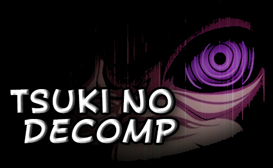

# Decomp-no-Me-UN5Decomp




**Decompilation of Naruto Shippuden: Ultimate Ninja 5**

A work-in-progress decompilation project aiming to recreate **Naruto Shippuden: Ultimate Ninja 5** from its original MIPS R5900 assembly into readable and maintainable C source code.

## 🎯 Project Goals

- Reverse engineer and document the game's executable.
- Reconstruct game systems and functions in C.
- Match the original MIPS R5900 assembly generated by the game.
- Identify and document functions, structures, classes, and global variables.
- Improve understanding of the game's internal architecture.
- Create a clean and maintainable codebase for research and preservation purposes.

## 🛠️ Target Platform

- **Platform:** PlayStation 2
- **Architecture:** MIPS R5900 / Emotion Engine
- **Game:** Naruto Shippuden: Ultimate Ninja 5
- **Language:** C
- **Status:** 🚧 Work in Progress

## Getting Started

Clone the repository:

```bash
git clone https://github.com/MiguelQueiroz010/Decomp-no-Me-UN5Decomp.git
cd Decomp-no-Me-UN5Decomp
```

### Requirements

The project currently expects the following tools to be available:

* Python 3
* GNU Make
* Splat
* `mips-linux-gnu-objcopy`

Project-specific tools can then be installed automatically with:

```bash
make tools
```

This downloads and prepares:

* Wibo 1.2.0
* objdiff-cli 3.8.0
* Metrowerks MWCCPS2 2.4

### Original executable

The original game executable is not distributed with this repository.

Provide your own executable and place it at:

```text
baserom/SLES_556.05
```

The expected SHA-256 is:

```text
20a43677397731a2a20899336d1165ace5b436906b9b89be90fb10f4558dd19d
```

You can verify it with:

```bash
sha256sum baserom/SLES_556.05
```

After placing the executable in the correct directory, prepare the project with:

```bash
make setup
```

This verifies the executable, generates the raw ROM, runs Splat and creates the assembly and extracted data required by the project.

## Make

### Install project tools

```bash
make tools
```

Downloads and prepares the tools used by the matching workflow.

### Prepare the project

```bash
make setup
```

Verifies `baserom/SLES_556.05`, generates the raw ROM and runs Splat.

### Match a function

```bash
make match FUNC=func_001974C0
```

Compiles the selected reconstructed C function and compares it against the corresponding code from the original executable.

An exact function should report:

```text
matching: 100.00%
```

### Build the reconstructed ELF

```bash
make elf
```

Builds an ELF using the currently reconstructed C functions.

## 🔬 Decompilation Approach

This project focuses on **matching the original executable**, rather than simply rewriting its behavior.

Functions are progressively analyzed from the original ELF, with attention to:

- MIPS R5900 instructions
- Calling conventions
- Stack frames
- Register usage
- Global variables
- Structures and object layouts
- Function relationships
- Memory addresses
- Compiler-generated code
- Floating-point operations
- EE-specific behavior

The ultimate goal is to produce source code that can reproduce the original game's executable as closely as possible.

## 📂 Project Structure

```text
UN5Decomp/
├── src/          # Decompiled C source code
├── include/      # Headers and definitions
├── asm/          # Assembly
├── assets/       # Extracted binary data
├── baserom/      # User-provided original executable
├── build/        # Generated build files
├── config/       # Splat and linker configuration
├── progress/     # Decompilation progress information
├── tools/        # Setup, matching and build tools
├── docs/         # Technical documentation
├── Makefile
└── README.md
```
